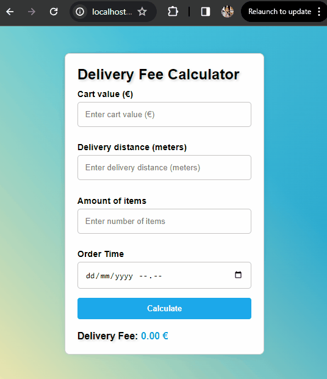

# Wolt Delivery Fee Calculator

## Overview

This web app is a frontend for delivery fee calculator built with React and TypeScript. It calculates the delivery fee based on user input, considering factors such as cart value, delivery distance, number of items, and order time. The project serves as the initial assignment for the Frontend track in the Wolt Summer 2024 Engineering Internships.

## Project preview

Explore a sneak peek of this project with this animated GIF showcasing key features and the user interface.

## Installation

Follow the steps below to set up and run the project locally:

1. Unzip the Zip archive
2. Navigate to the project directory: `delivery-fee-calculator-Elena-Golovanova`
3. Install dependencies: `npm install`
4. Start the app: `npm run dev`

## Technologies Used

- React
- TypeScript
- Jest (testing framework)

## Author

Elena Golovanova
- [GitHub](https://github.com/ElenaCoder/)
- [LinkedIn](https://www.linkedin.com/in/elena-golovanova/)

## Inputs and Test IDs

As per the requirements, the specified attribute has been incorporated into both input elements and the element responsible for displaying the calculated fee. This attribute serves the purpose of identifying elements during automated testing.

- Cart value: `<input data-test-id="cartValue" />`
- Delivery distance: `<input data-test-id="deliveryDistance"/>`
- Number of items: `<input data-test-id="numberOfItems"/>`
- Order time: `<input data-test-id="orderTime"/>`
- Resulting fee: `

`

## Specification

Build a delivery fee calculator app which calculates a delivery fee based on user input and shows the calculated delivery fee to the user.

#### Input fields

| Field             | Type      | Description                                                                                             | Example value                             |
|:---               |:---       |:---                                                                                                     |:---                                       |
|Cart value         |Float      |Value of the shopping cart in euros.                                                                     |__20__                                     |
|Delivery distance  |Integer    |The distance between the store and customer’s location __in meters__.                                    |__2235__ (2235 meters = 2.235 km)          |
|Number of items    |Integer    |The __number of items__ in the customer's shopping cart.                                                 |__4__ (customer has 4 items in the cart)   |
|Order time         |Date + Time|The date/time when the order is being made (see rules-section how rush hours affect the delivery price)  |You can choose the most suitable format    |

**Rules for calculating a delivery fee**
* If the cart value is less than 10€, a small order surcharge is added to the delivery price. The surcharge is the difference between the cart value and 10€. For example if the cart value is 8.90€, the surcharge will be 1.10€.
* A delivery fee for the first 1000 meters (=1km) is 2€. If the delivery distance is longer than that, 1€ is added for every additional 500 meters that the courier needs to travel before reaching the destination. Even if the distance would be shorter than 500 meters, the minimum fee is always 1€.
  * Example 1: If the delivery distance is 1499 meters, the delivery fee is: 2€ base fee + 1€ for the additional 500 m => 3€
  * Example 2: If the delivery distance is 1500 meters, the delivery fee is: 2€ base fee + 1€ for the additional 500 m => 3€
  * Example 3: If the delivery distance is 1501 meters, the delivery fee is: 2€ base fee + 1€ for the first 500 m + 1€ for the second 500 m => 4€
* If the number of items is five or more, an additional 50 cent surcharge is added for each item above and including the fifth item. An extra "bulk" fee applies for more than 12 items of 1,20€
  * Example 1: If the number of items is 4, no extra surcharge
  * Example 2: If the number of items is 5, 50 cents surcharge is added
  * Example 3: If the number of items is 10, 3€ surcharge (6 x 50 cents) is added
  * Example 4: If the number of items is 13, 5,70€ surcharge is added ((9 * 50 cents) + 1,20€)
  * Example 5: If the number of items is 14, 6,20€ surcharge is added ((10 * 50 cents) + 1,20€)
* The delivery fee can __never__ be more than 15€, including possible surcharges.
* The delivery is free (0€) when the cart value is equal or more than 200€.
* During the Friday rush, 3 - 7 PM, the delivery fee (the total fee including possible surcharges) will be multiplied by 1.2x. However, the fee still cannot be more than the max (15€). Considering timezone, for simplicity, **use UTC as a timezone in backend solutions** (so Friday rush is 3 - 7 PM UTC). **In frontend solutions, use the timezone of the browser** (so Friday rush is 3 - 7 PM in the timezone of the browser).

## Assumptions

Due to the fact that certain requirements were not strictly defined the application has been developed with certain assumptions in mind:

- The Friday rush is defined as the period from 3 PM (inclusive) to 7 PM (exclusive).
- Although the main objective is to calculate delivery fees for future orders, the current implementation allows users to select past dates. Consequently, users can explore the potential delivery cost for a specific date and time in the past.

## Inspirations

This project was inspired by the web development tutorial by [Lama Dev](https://youtu.be/tIdNeoHniEY?si=x-pBEeNngmGOSdpb).
